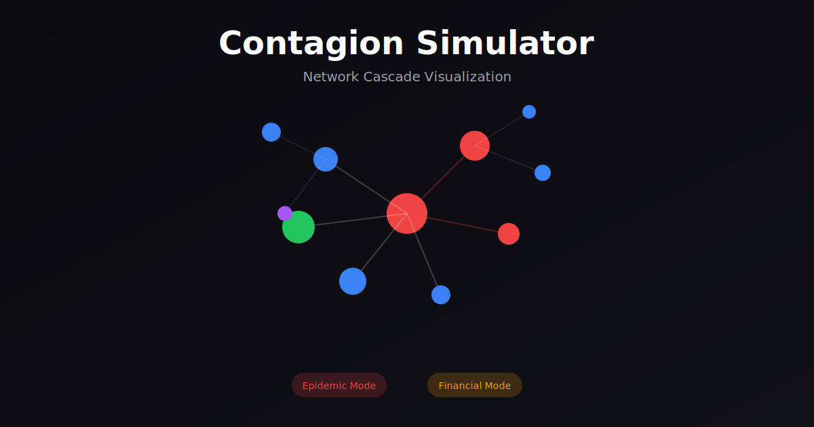

# 🦠 Contagion Simulator

A real-time network cascade visualization that simulates both **epidemic spread** and **financial contagion** through interconnected systems.



## ✨ Features

### Dual Simulation Modes

| Mode | Model | Demo Scenario |
|------|-------|---------------|
| **Epidemic** | SIR+ (Susceptible → Infected → Recovered → Deceased) | Watch herd immunity stop an outbreak |
| **Financial** | Systemic Risk (bank defaults cascade through interlinked institutions) | Click a hub bank — watch the system collapse |

### Key Features

- 🎯 **8 Pre-configured Presets** — Dramatic scenarios ready to explore
- 🎨 **Color-Blind Safe Mode** — Accessible to all users
- ⌨️ **Keyboard Shortcuts** — Professional-grade controls
- 🔄 **Real-time Visualization** — 200+ nodes at 60fps
- 📊 **Live Statistics** — Track R₀, infection rates, systemic risk
- 🌐 **3 Network Topologies** — Scale-free, Small-world, Random

## 🚀 Quick Start

```bash
# Install dependencies
npm install

# Run development server
npm run dev

# Open http://localhost:3000
```

## 🎮 Controls

| Key | Action |
|-----|--------|
| `Space` | Play / Pause |
| `R` | Reset simulation |
| `→` | Step forward |
| `1` | Switch to Epidemic mode |
| `2` | Switch to Financial mode |
| `C` | Toggle color-blind mode |

**Mouse:**
- **Click node** — Infect (epidemic) or Shock (financial)
- **Drag node** — Reposition
- **Scroll** — Zoom in/out
- **Drag canvas** — Pan

## 📊 Simulation Models

### Epidemic (SIR+)

**States:** SUSCEPTIBLE → INFECTED → RECOVERED/DECEASED

**Parameters:**
- **β (Beta)** — Infection probability per contact
- **γ (Gamma)** — Recovery probability per tick
- **μ (Mu)** — Mortality probability while infected
- **Vaccination Rate** — % of population immune at start

**Infection Probability:**
```
P(infection) = 1 - (1 - β)^(infected_neighbors)
```

### Financial (Systemic Risk)

**States:** HEALTHY → STRESSED → DISTRESSED → DEFAULTED/BAILED_OUT

**Parameters:**
- **Leverage Ratio** — Debt/Equity (higher = riskier)
- **Capital Buffer** — Minimum capital requirement
- **Correlation Factor** — How linked asset prices are
- **Fire Sale Discount** — Price drop when distressed sell
- **Bailout Threshold** — Minimum size for government rescue

**Cascade Mechanism:**
1. Initial shock reduces capital ratio
2. Direct exposure losses from defaults
3. Fire sale contagion (mark-to-market losses)
4. Feedback loop until system stabilizes

## 🎯 Demo Presets

### Epidemic Presets
- **Dramatic Outbreak** — High β, slow γ, infect the super-spreader
- **Herd Immunity** — 65% vaccination stops the outbreak
- **Slow Burn** — Low infection rate through dense network
- **Rapid Recovery** — Fast recovery limits spread

### Financial Presets
- **Too Big to Fail** — Shock largest bank, watch cascade
- **Bailout Intervention** — Same shock, bailouts prevent collapse
- **Isolated Failure** — Low correlation contains damage
- **Contagion Cascade** — High correlation causes system collapse

## 📄 License

MIT

## 👤 Author

**Roshan Shetty**
- Portfolio: [roshanshetty.dev](https://roshanshetty.dev)
- LinkedIn: [/in/roshanshetty271](https://linkedin.com/in/roshanshetty271)
- GitHub: [/roshanshetty271](https://github.com/roshanshetty271)

---

*"Watch diseases spread through populations or financial crises cascade through banking networks — in real-time, in your browser."*
